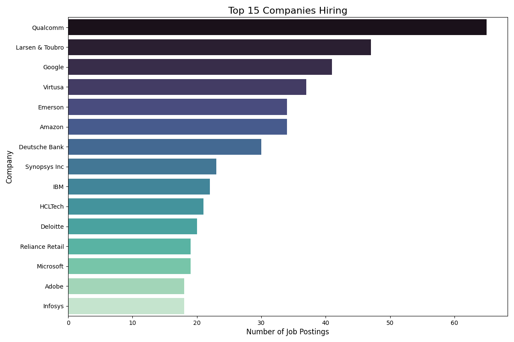

# Top Companies Hiring Analysis

## Key Insights
Based on the provided hiring data, here are some key insights into the competitive landscape for talent:

### Competitive Landscape for Talent: Key Insights

The list of top hiring companies reveals a diverse yet intensely competitive environment for talent, extending beyond the typical tech giants.

1.  **Dominance of Specialized Tech & Industrial Engineering:**
    *   **Qualcomm's significant lead (65 hires)** highlights a very strong demand in the semiconductor and wireless technology sector. This suggests a high need for specialized engineering talent (e.g., electrical engineers, chip designers, embedded systems).
    *   **Larsen & Toubro's strong second position (47 hires)** underscores the robust demand in traditional engineering, infrastructure, and heavy industry sectors. This indicates a consistent need for civil, mechanical, and project management engineers.

2.  **Broad-Based Tech Demand, with Nuances:**
    *   While **Google (41 hires)** remains a top contender, signifying continuous demand for software engineers, AI/ML specialists, and data scientists, other "Big Tech" players like **Amazon (34 hires)**, **Microsoft (19 hires)**, and **Adobe (18 hires)** are present but not at the very top. This suggests that while they are significant players, their hiring volume in this specific dataset is either more focused or distributed compared to the leaders.
    *   **Synopsys Inc (23 hires)** further reinforces the strong demand for Electronic Design Automation (EDA) and semiconductor talent.
    *   **IBM (22 hires)** continues to be a major recruiter, reflecting demand across enterprise software, cloud, and consulting.

3.  **Resilience of IT Services & Consulting:**
    *   Companies like **Virtusa (37 hires)**, **HCLTech (21 hires)**, and **Infosys (18 hires)** demonstrate the continued high volume of hiring within the IT services and consulting sector. This indicates a consistent need for IT professionals across various domains, including application development, infrastructure management, and digital transformation.
    *   **Deloitte (20 hires)** reinforces the demand for professional services and consulting talent, encompassing business analysts, management consultants, and technology consultants.

4.  **Demand Beyond Pure Tech:**
    *   The presence of **Emerson (34 hires)** in industrial automation and manufacturing, **Deutsche Bank (30 hires)** in finance, and **Reliance Retail (19 hires)** in retail, shows that the talent war isn't confined solely to tech and IT services. These sectors are also aggressively hiring, requiring specialized skills in finance, operations, supply chain, and retail management, often with a growing tech component.

**In summary, the competitive landscape for talent is highly diversified.** Companies are vying for a broad spectrum of skills, from highly specialized semiconductor and industrial engineering to general software development, IT services, consulting, and finance. While tech is undoubtedly a major driver, the data highlights that demand for talent is strong across various established and traditional industries, making the competition for skilled professionals fierce and multi-faceted. Talent acquisition strategies need to consider this wide array of strong competitors, not just the usual suspects in the software world.
