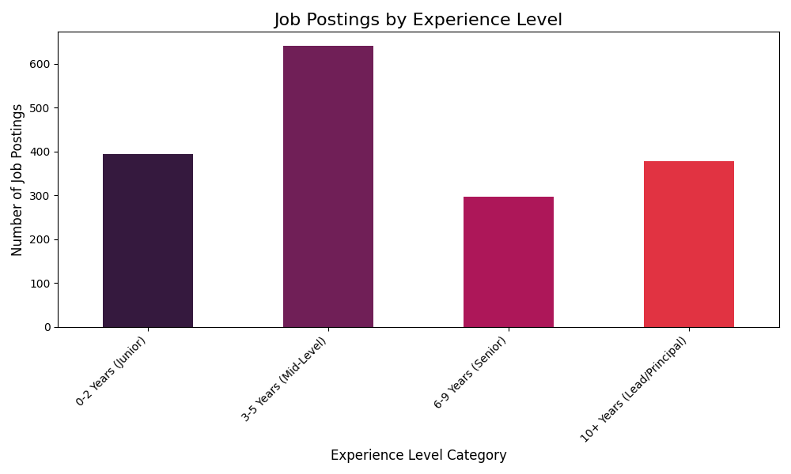

# Job Experience Level Analysis

## Key Insights
As a talent strategist, the distribution of job postings by experience level provides crucial insights into the current talent market demand.

---

### **Key Insights: Job Posting Demand by Experience Level**

Based on the provided data, here are some key observations regarding the demand for different levels of seniority:

1.  **Dominance of Mid-Level Professionals (3-5 Years):**
    *   The most striking insight is the overwhelming demand for **Mid-Level (3-5 Years)** professionals, with 641 postings. This suggests that companies are primarily seeking individuals who can contribute immediately, possess proven skills, and require less extensive training than junior hires, while potentially being more cost-effective than highly senior personnel. This experience band represents a sweet spot for many organizations.

2.  **Strategic Demand for Lead/Principal Roles (10+ Years):**
    *   There is a significant demand for **Lead/Principal (10+ Years)** roles (378 postings), which is notably higher than the "Senior" category. This indicates a consistent need for top-tier strategic leadership, highly specialized expertise, and roles that drive significant impact (e.g., architecture, principal engineering, strategic advisory), even if the volume isn't as high as mid-level roles.

3.  **Steady Investment in Junior Talent (0-2 Years):**
    *   The demand for **Junior (0-2 Years)** professionals (394 postings) is robust. This signifies that companies are actively investing in their talent pipeline, bringing in entry-level candidates who can be trained and developed. While not as high as mid-level, it shows a healthy commitment to future growth.

4.  **Lowest Demand for "Senior" Roles (6-9 Years):**
    *   Interestingly, the demand for **Senior (6-9 Years)** professionals is the lowest among all categories (297 postings). This could imply several factors:
        *   Organizations might be promoting internally for many of these roles, reducing the need for external hires.
        *   The market might be segmenting more directly from "Mid-Level" to "Lead/Principal" for external hires, focusing on individuals who can truly lead or provide highly specialized, strategic input.
        *   The skillset for this band might be more niche, or the market is saturated with candidates at this level.

**Overall Implication:**

The data paints a picture of a job market heavily weighted towards **immediate contributors (Mid-Level)** and **strategic leaders/experts (Lead/Principal)**. While companies are still feeding their talent pipeline with **Junior** hires, the relatively lower demand for the "Senior" (6-9 years) band suggests a more specific or internal focus for these roles, or perhaps a preference to jump directly to highly experienced "Lead/Principal" talent for external recruitment drives. This distribution indicates a focus on productivity, proven experience, and top-tier leadership over a broad recruitment for general senior roles.
