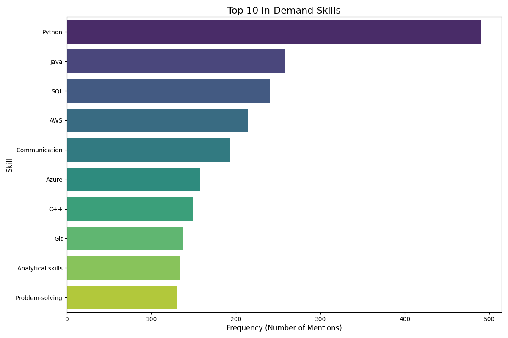
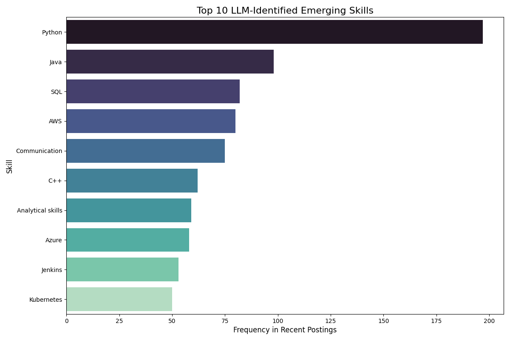

# Job Market Skills Analysis

## Executive Summary
This report provides a strategic analysis of current and emerging skill trends in the technology job market, contextualized for our company's unique position as a leading semiconductor provider for AI systems, data centers, and networks. Our analysis, based on recent job market data, reveals a strong foundational demand for core programming and cloud skills, alongside a critical shift towards DevOps and cloud-native infrastructure expertise.

The insights underscore the need to reinforce our deep technical strengths, particularly in power-efficient, high-performance custom silicon, while aggressively embracing automation and scalable infrastructure practices. Strategic talent acquisition and targeted employee development will be crucial to accelerate our AI and data infrastructure goals, deepen customer partnerships, and maintain our competitive edge across Data Centers, Automotive, Enterprise Networking, and Carrier Infrastructure markets.

---

## 1.

## Top In-Demand Skills

### Key Insights from the 'Top In-Demand Skills' Chart
Key Insightsfrom 'Top In-Demand Skills'

The `top_skills.png` chart, based on the most frequently mentioned skills, reflects the established core competencies driving the industry:

*   **Programming Language Foundation:** Python (490) dominates, indicating its pervasive use across AI/ML, data science, scripting, and backend development. Java (258) and C++ (150) also hold significant positions. For a semiconductor company focused on high-performance and custom silicon, the enduring demand for **C++ is particularly critical**, signifying the need for deep systems-level programming capabilities essential for chip design tools, embedded systems, and optimizing performance.
*   **Cloud Computing Proficiency:** AWS (215) and Azure (158) are highly sought after, reflecting the industry's pervasive shift towards cloud-based solutions and infrastructure. This is directly relevant to our Data Center and Carrier Infrastructure markets.
*   **Data Management:** SQL (240) remains a fundamental skill, essential for managing and querying the vast datasets integral to AI and data infrastructure.
*   **Critical Soft Skills:** Communication (193), Analytical skills (134), and Problem-solving (131) rank prominently. This highlights that alongside technical prowess, the ability to collaborate effectively, interpret complex data, and overcome challenges is highly valued. For our company, these skills are vital for fostering "deep customer partnerships" and enabling "shoulder-to-shoulder collaboration."
*   **Version Control:** Git (138) is a standard development practice, indicating the necessity for collaborative and managed code development.

**Strategic Implication:** Our current talent pool likely possesses many of these core skills. The high demand for communication and analytical skills validates our focus on customer-centric and problem-solving approaches inherent in custom silicon development.

---

## 2.

## Emerging Skills

### Key Insights from the 'Emerging Skills' Chart
# Strategic Talent Landscape Report: Accelerating AI and Data Infrastructure

## Executive Summary

This report provides a strategic analysis of current and emerging skill trends in the technology job market, contextualized for our company's unique position as a leading semiconductor provider for AI systems, data centers, and networks. Our analysis, based on recent job market data, reveals a strong foundational demand for core programming and cloud skills, alongside a critical shift towards DevOps and cloud-native infrastructure expertise.

The insights underscore the need to reinforce our deep technical strengths, particularly in power-efficient, high-performance custom silicon, while aggressively embracing automation and scalable infrastructure practices. Strategic talent acquisition and targeted employee development will be crucial to accelerate our AI and data infrastructure goals, deepen customer partnerships, and maintain our competitive edge across Data Centers, Automotive, Enterprise Networking, and Carrier Infrastructure markets.

---

## 1. Key Insights from 'Top In-Demand Skills'

The `top_skills.png` chart, based on the most frequently mentioned skills, reflects the established core competencies driving the industry:

*   **Programming Language Foundation:** Python (490) dominates, indicating its pervasive use across AI/ML, data science, scripting, and backend development. Java (258) and C++ (150) also hold significant positions. For a semiconductor company focused on high-performance and custom silicon, the enduring demand for **C++ is particularly critical**, signifying the need for deep systems-level programming capabilities essential for chip design tools, embedded systems, and optimizing performance.
*   **Cloud Computing Proficiency:** AWS (215) and Azure (158) are highly sought after, reflecting the industry's pervasive shift towards cloud-based solutions and infrastructure. This is directly relevant to our Data Center and Carrier Infrastructure markets.
*   **Data Management:** SQL (240) remains a fundamental skill, essential for managing and querying the vast datasets integral to AI and data infrastructure.
*   **Critical Soft Skills:** Communication (193), Analytical skills (134), and Problem-solving (131) rank prominently. This highlights that alongside technical prowess, the ability to collaborate effectively, interpret complex data, and overcome challenges is highly valued. For our company, these skills are vital for fostering "deep customer partnerships" and enabling "shoulder-to-shoulder collaboration."
*   **Version Control:** Git (138) is a standard development practice, indicating the necessity for collaborative and managed code development.

**Strategic Implication:** Our current talent pool likely possesses many of these core skills. The high demand for communication and analytical skills validates our focus on customer-centric and problem-solving approaches inherent in custom silicon development.

---

## 2. Key Insights from 'Emerging Skills'

The `emerging_skills.png` chart, representing skills trending in recent job postings, points towards future critical needs and shifts within the industry:

*   **Continued Dominance and Reinforcement of Core Skills:** Python (197), Java (98), SQL (82), AWS (80), Communication (75), C++ (62), Analytical skills (59), and Azure (58) remain highly sought after. This signifies that the foundational skills identified in the "Top In-Demand Skills" chart are not diminishing in importance but are, in fact, growing or maintaining their relevance in newer contexts. The sustained demand for **C++** in emerging trends further reinforces its strategic importance for our low-level hardware and performance optimization work.
*   **Significant Emergence of DevOps and Cloud-Native Technologies:** The most notable shift is the strong appearance of **Jenkins (53)** and **Kubernetes (50)** in the top 10 emerging skills.
    *   **Jenkins** points to a high demand for Continuous Integration/Continuous Delivery (CI/CD) expertise, crucial for automating software development, testing, and deployment pipelines.
    *   **Kubernetes** signifies the growing importance of container orchestration, enabling scalable, resilient, and portable application deployments, particularly critical for cloud-native AI and data center solutions.
*   **Shift from Foundational Tools to Automation & Orchestration:** While Git and Problem-solving were in the top 10 overall, Jenkins and Kubernetes have taken their place in the emerging list. This suggests a maturing industry where foundational practices (like version control and general problem-solving) are assumed, and the focus is shifting towards *automating and scaling* those practices.

**Strategic Implication:** The strong emergence of Jenkins and Kubernetes indicates a critical industry imperative towards faster development cycles, more robust deployments, and efficient management of complex AI and data infrastructure. For our company, this directly impacts our goal to "accelerate AI and data infrastructure" and enhance "reliable execution" for our custom silicon solutions across all target markets.

---

## 3.

## Actionable Recommendations
Actionable RecommendationsBased on the analysis of current and emerging skill trends, combined with our company's profile and strategic goals, the following recommendations are proposed:

1.  **Strategic Talent Acquisition & Recruitment Focus:**
    *   **Prioritize DevOps & Cloud-Native Talent:** Actively recruit experienced engineers with strong expertise in **Jenkins and Kubernetes**. These roles are crucial for building robust CI/CD pipelines, managing scalable data center infrastructure, and enabling faster, more reliable deployments of our custom silicon solutions for AI and cloud customers.
    *   **Reinforce Core Technical Depth:** Continue to aggressively recruit talent with deep expertise in **C++** for low-level programming, hardware interaction, and performance optimization critical for our custom silicon design in AI, networking, and automotive. Ensure strong Python and cloud (AWS/Azure) expertise for AI model integration, cloud solution development, and data infrastructure.
    *   **Emphasize Soft Skills in Hiring:** Integrate structured assessments for Communication, Analytical, and Problem-solving skills into the interview process. These are paramount for fostering the "deep customer partnerships" and "shoulder-to-shoulder collaboration" that define our work style.

2.  **Targeted Employee Development & Upskilling Programs:**
    *   **"Accelerating Infrastructure" Initiative:** Launch comprehensive internal training and certification programs in **Jenkins and Kubernetes** for our existing engineering, SRE, and operations teams. This will empower them to build more efficient, automated, and scalable environments, directly supporting our goal of accelerating AI and data infrastructure.
    *   **Advanced Silicon & Performance Optimization:** Invest in advanced training for our engineers in C++ and domain-specific optimization techniques relevant to power-efficient, high-performance custom silicon design. This strengthens our core differentiator.
    *   **Cloud Specialization for Solutions Architects:** Fund AWS and Azure advanced certifications for teams working on customer-facing cloud solutions, especially those supporting data centers and carrier infrastructure, to deepen integration capabilities.
    *   **Customer Collaboration Excellence:** Develop workshops and mentorship programs focused on enhancing communication, negotiation, and problem-solving skills for all customer-facing roles, reinforcing our collaborative work style.

3.  **Internal Process & Infrastructure Modernization:**
    *   **Embrace DevOps Principles Internally:** Fully adopt and integrate CI/CD practices using Jenkins, and leverage Kubernetes for internal development and testing environments. This mirrors the emerging industry trend, improves our "reliable execution," and allows our internal teams to understand customer needs better.
    *   **Automate Custom Silicon Validation:** Explore how CI/CD pipelines can be adapted for hardware design and validation to accelerate the development cycle of our specialized chips for AI computing and automotive markets.

4.  **Strategic Partnerships & Ecosystem Engagement:**
    *   **Academic Collaborations:** Partner with universities and technical institutions to develop curricula that include specialized C++ for hardware, AI system integration, and critical DevOps skills like Kubernetes. This creates a pipeline of future talent aligned with our evolving needs.
    *   **Open-Source Contribution:** Actively contribute to open-source projects related to Kubernetes, AI frameworks, and cloud-native technologies. This enhances our employer brand, attracts talent, and allows us to influence the direction of critical industry standards.

By strategically addressing these skill trends, we can ensure our workforce remains at the forefront of innovation, further cementing our leadership in accelerating AI and data infrastructure and delivering optimized, custom silicon solutions for our customers.
