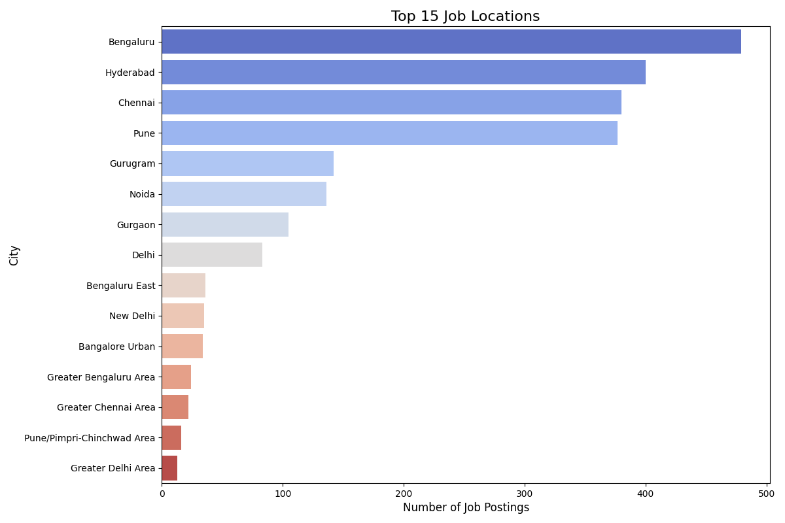

# Job Location Analysis

## Key Insights
## Market Analysis: Top Job Locations

This analysis examines the provided data on top job locations by number of postings to identify key trends and noticeable hubs within the job market.

### Key Insights & Noticeable Hubs

1.  **Dominance of Established IT/Tech Hubs (Tier 1):**
    *   **Bengaluru (including variants: Bengaluru, Bengaluru East, Bangalore Urban, Greater Bengaluru Area)** is the undisputed leader, with an aggregated total of approximately **573 postings**. This reinforces its status as India's "Silicon Valley."
    *   **Hyderabad (400 postings)**, **Chennai (including Greater Chennai Area: ~402 postings)**, and **Pune (including Pune/Pimpri-Chinchwad Area: ~393 postings)** form a strong second tier.
    *   **Insight:** These four cities collectively account for the vast majority of job postings. Their long-standing reputation as major IT, software, and R&D centers in India strongly suggests that a significant portion of these jobs are in the technology, software development, and IT-enabled services sectors.

2.  **Emergence of the National Capital Region (NCR) as a Major Hub (Tier 2):**
    *   The Delhi National Capital Region (NCR), comprising **Gurugram (142)**, **Noida (136)**, **Gurgaon (105)**, **Delhi (83)**, **New Delhi (35)**, and **Greater Delhi Area (13)**, represents a substantial cluster of jobs. Aggregated, Gurugram/Gurgaon has approximately **247 postings**, and the broader Delhi region has around **131 postings**.
    *   **Insight:** The NCR is a diverse economic zone with strong presences in IT, manufacturing, services, and corporate headquarters. While individually lower than the top Southern/Western cities, their combined strength makes the NCR a significant job market, likely indicating roles in both tech and broader corporate/service industries.

3.  **Concentration within Cities:**
    *   The presence of specific locality names like "Bengaluru East," "Bangalore Urban," "Greater Chennai Area," and "Pune/Pimpri-Chinchwad Area" indicates that even within these large cities, there are specific high-activity zones or extended metropolitan areas where job opportunities are concentrated.

### What these locations tell about the job market:

*   **Technology-Centric:** The overwhelming prominence of Bengaluru, Hyderabad, Chennai, and Pune points towards a job market heavily driven by the Information Technology, Software Development, and IT-Enabled Services (ITES) industries.
*   **Geographical Concentration:** Job opportunities are highly concentrated in a few major metropolitan areas, particularly in South India and the National Capital Region. This suggests that while talent may be nationwide, the major employers and job creation centers are predominantly urban.
*   **Urban Hubs:** The data highlights the continued importance of large urban centers as economic engines and magnets for talent and job creation.

In summary, the job market as depicted by this data is highly concentrated in a few key metropolitan hubs, with a strong leaning towards the technology sector, particularly in South India, followed by the diverse opportunities available in the National Capital Region.
